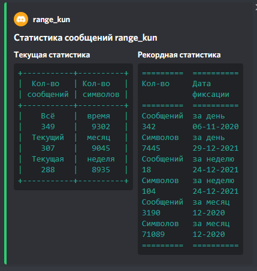

# Discord Bot for Heroku

### This bot was written for users of Russian servers, and send all data in russian. Although the code and database structure was written in English 

### General information
- All configurations can be done with using config.py file and .env file
- Log data would be stored in /home/discord/logs
- Database would be created on your machine

### To begin with bot next steps required:
1. Make sure you have docker and docker-compose installed on your machine
2. Create .env file and add all data as in .env-template
    - You need to get discord bot token 
    - Create discord application with support of application.commands,  administrator privileges (optional) 
   and Privileged Gateway Intents enabled
    - Redis database credentials
    - Google search token (more info here https://developers.google.com/webmaster-tools/search-console-api/v1/configure 
   or here https://www.youtube.com/watch?v=-uy4L4P1Ujs)
3. Run: docker-compose build and docker-compose up, this would create database on your machine and apply migrations and start your bot

### Available  features:
1. Support of slash commands with description
2. Basic admin commands: ban, kick, mute, unmute
3. Deleting messages using the ?clear command 
4. Getting a random picture using Google engine 
5. Possibility of search queries in Google
6. Creating poll messages, what will send results at the end of the vote time.
7. Extensive opportunities to calculate the statistics of messages. This bot can keep message and symbols stats.
   - Track stats for different periods of time: day, week and all time together. As well, it will handle maximum stats for users and server overall.
8. By the end of the: day, week, month bot will automatically send message stats
9. Feature to save and get users quotes.
10. You can save events from your life in database and then get them. As well, you can query group your memories by different periods of time.
11. Prohibition on use CAPS LOCK mode by admin desire.
12. Available translation to different languages with Google Translate api
13. Sending voice messages
14. Get random fun fact
15. Birthday reminder by schedule for users on channel, with commands to manage their birthdays.

### Thanks:
Some parts of code been copy-pasted (or used as starting point) and then updated to be used inside my bot, here is the references:  
Point 3, 4, 12 -> https://github.com/appu1232/Discord-Selfbot 
Point 6 -> https://github.com/stayingqold/Poll-Bot 
PS I hope it's legal and I won't go to jail ^_^
